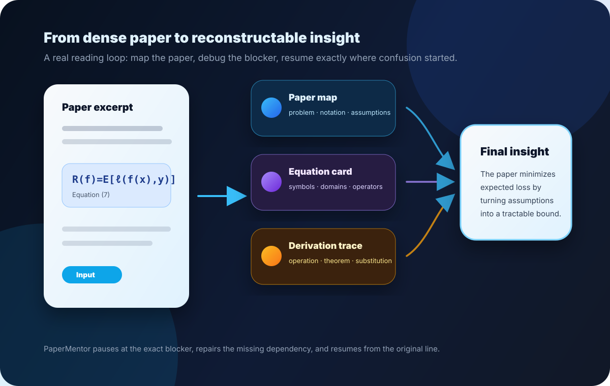

<div align="center">

# PaperMentor

### Upload a paper or slides. Understand the hard part in 30 minutes.

Not a summarizer — an **AI Agent Skill** that debugs equations, derivations, dependencies, slide narration, and conceptual confusion until you can reconstruct the source yourself.



[](#install)
[](skills/papermentor/SKILL.md)
[](https://code.claude.com/docs/en/skills)
[](#what-the-output-looks-like)
[](LICENSE)

**Do not summarize papers. Debug understanding.**

</div>

---

## Why PaperMentor exists

Most reading tools compress the source. PaperMentor does the opposite: it slows down at the exact line, equation, slide, or definition where understanding breaks.

A useful session should leave you able to reconstruct:

- the problem and core intuition,
- every major equation or notation-heavy slide,
- every derivation transition,
- the dependency chain between definitions, assumptions, lemmas, methods, examples, visuals, and claims,
- and the final insight in one sentence.

---

## See it work

PaperMentor follows one repeatable loop:

<table>
<tr>
<td width="25%" valign="top">

### 1. Upload
Paste the paper, PDF text, or a target section.

`Use $papermentor to scan this paper.`

</td>
<td width="25%" valign="top">

### 2. Map
Find the problem, notation, assumptions, claims, and equations.

`Build the paper map.`

</td>
<td width="25%" valign="top">

### 3. Debug
Pick the blocker: equation, derivation, proof, method, or dependency.

`Explain Equation (7) atomically.`

</td>
<td width="25%" valign="top">

### 4. Reconstruct
Resume from the paused line and extract the final insight.

`Extract the final insight.`

</td>
</tr>
</table>

Interrupt anytime: `Pause. Why did the sign flip here?` PaperMentor answers the missing concept, reconnects it to the original line, and continues from the exact location.

---

## Install

Codex:

```bash
curl -fsSL https://raw.githubusercontent.com/ShinyJay2/PaperMentor/main/install.sh | bash
```

Claude Code:

```bash
curl -fsSL https://raw.githubusercontent.com/ShinyJay2/PaperMentor/main/install.sh | bash -s claude
```

Both:

```bash
curl -fsSL https://raw.githubusercontent.com/ShinyJay2/PaperMentor/main/install.sh | bash -s all
```

Windows PowerShell:

```powershell
iwr -useb https://raw.githubusercontent.com/ShinyJay2/PaperMentor/main/install.ps1 | iex
```

For stricter supply-chain control, clone a tagged release or pinned commit, inspect it, then run `./install.sh codex` locally instead of piping from `main`.

Install locations:

```text
Codex:       ~/.codex/skills/papermentor
Claude Code: ~/.claude/skills/papermentor
```

---

## Start in one command

After cloning the repo or opening the installed skill folder, launch a reading room directly from a paper URL or local file:

```bash
pm https://arxiv.org/pdf/2602.04770
```

PaperMentor downloads the source when needed, extracts the title and authors, detects sections, creates `index.html`, attaches the representative method/system figure when it can, and writes a crop preview for quick recropping.

Open the command palette any time:

```bash
pm
pm open
pm go
pm ask "What does this equation mean?"
pm export
```

Advanced/internal commands are still available through `papermentor help --advanced`.

```text
.papermentor/sessions/<paper>/
  index.html          # the reading room
  crop-preview.html   # visual recrop candidates and commands
  state.json          # current section/action state
```

Local files work the same way:

```bash
pm ./paper.pdf
pm ./paper.pdf --mode paper
pm ./slides.pptx --mode slide
```

Want to inspect the figure crop before committing it to the report?

```bash
papermentor preview-crops --session <paper-slug> --source paper.pdf --page 1
```

---


## Source modes

PaperMentor has two source modes. By default it detects the mode from the uploaded material:

| Mode | Use it for | First thing rendered | CLI menus become |
| --- | --- | --- | --- |
| `paper` | arXiv papers, conference papers, technical reports | one-sentence paper model, representative method figure, preliminaries | detected sections → equations, derivations, dependencies, figures, ask/chat |
| `slide` | PPT/PDF slides and lecture slides | slides map and visual reading contract | slides → missing narration, visual labels, transitions, equations, ask/chat |

PaperMentor is intentionally optimized for concrete reading artifacts: papers and slides.

---

## HTML-first reading room

The session helper keeps one `index.html` open, starts with a compact usage block, and appends a new explanation block after each chosen reading action. The TUI writes a `pending-prompt.md` runner prompt for the selected action, and `extract-figure` can attach real PDF/PPT/image crops for method figures instead of diagrams. Reports bundle fonts and MathJax locally, so the reading room works without CDN font/math requests. To share or download a finished reading room, export either a one-file PDF or a portable HTML zip bundle:

```bash
papermentor export --session <paper-slug> --format pdf --output papermentor-report.pdf --overwrite
papermentor export --session <paper-slug> --format zip --output papermentor-report.zip --overwrite
```

Use PDF for a single shareable file. Use ZIP when you want the interactive local HTML bundle; unzip it anywhere and open `index.html`. It is a report bundle, not a blog export.


PaperMentor is guided but interruptible. For each source, it renders the HTML reading room first. The CLI is only a navigator for section choices, mode choices, and user questions; explanations are appended to one local HTML document:

```text
.papermentor/sessions/<paper-slug>/
  index.html      # rendered paper blocks, appended one section at a time
  state.json      # current location, Reading Path, choices
  cards.json      # promoted study blocks
  turns.jsonl     # raw-ish conversation history
  notes.md        # portable Markdown notes
```

The browser view is intentionally minimal: a quiet paper title sheet followed by rendered explanation blocks. The first block is `How to use this reading room`, explaining the HTML + CLI/TUI workflow, refresh behavior, and PDF snapshot behavior. The next block is `Start Here`: one sentence about what the source teaches or claims, the actual representative method/system figure when present, and detailed preliminaries needed before section-level reading. No left panel, no product header, no app chrome, and no “likely blockers” lists in HTML. Blockers and next actions stay in the terminal. The terminal runs as an arrow-key navigator:

```text
╭──────────────────────────── PaperMentor Live ─────────────────────────────╮
│ View: .papermentor/sessions/<paper>/index.html                             │
│ Focus: 3. Drifting Models for Generation                                    │
├─────────────────────────────────────────────────────────────────────────────┤
│ Section actions (↑/↓ select · Enter choose · / ask anything · q quit)       │
│  01  Give a compact method overview for this section                        │
│  02  Explain Eq. (1) pushforward symbol by symbol                           │
│  03  Trace Eq. (4) → Eq. (6) fixed-point objective                          │
│  04  Explain why stopgrad is used and what would break without it           │
│  05  Build the dependency chain for the method section                      │
│  06  Ask anything about 3. Drifting Models for Generation                   │
│  07  Chat about this section                                                │
╰─────────────────────────────────────────────────────────────────────────────╯
```

The action list is not hard-coded. PaperMentor inspects the selected section first: Introduction menus come from motivation and core concepts, Related Work menus can follow citations and compare method families, Method menus expose equations/propositions/algorithms, and Experiment menus focus on metrics, figures, and supported claims.

When confusion is structural rather than definitional, PaperMentor can offer a visual repair action:

```text
Visual repair suggested
  Draw method pipeline
  Map equation dependencies
  Build concept prerequisite graph
```

Those diagrams are deterministic mono-tone SVG blocks generated by PaperMentor. They are clearly labeled as conceptual diagrams, never as figures from the paper.

Open `index.html` for rendered LaTeX. Answer with a number or interrupt naturally. Use semantic equation block titles such as `Training objective — Eq. (6)` so the block is readable and still traceable to the paper.

Paper-related interruptions are not dumped into the report as chat logs. PaperMentor logs turns in `turns.jsonl`, then automatically promotes useful understanding repairs into polished blocks with a visible **User question**, missing dependency, answer, paper reconnection, and resume point. Meta/tooling chatter stays out of HTML unless you explicitly say `save this` or `add this to report`; `don't save this` keeps it out.

Reports use bundled local fonts: **Satoshi** for English and **Pretendard** for Korean. The installer copies only runtime assets into the skill, and each generated session hardlinks bundled fonts/MathJax when the filesystem supports it, falling back to copies when needed. The report typography and LaTeX rendering work offline without remote font or MathJax CSS.

Remote paper/slide downloads require HTTPS by default because local native tools parse the downloaded file. For trusted local test servers only, pass `--allow-insecure-http`.

---

## Try the sample paper

Use the included sample to see the full interaction shape before trying a real paper:

```text
Use $papermentor on demo/sample-paper.md. Start with a paper map, then explain the population risk equation atomically, trace why empirical risk is introduced, and finish with the final insight.
```

Reference outputs live in [`demo/outputs`](demo/outputs): paper map, equation card, derivation trace, and final insight.

---

## Command intents

One-line starts:

```bash
papermentor start --title "My source" --source source.pdf
papermentor analyze --session my-source --paper-text-file source.txt
papermentor tui --session my-source
```

- `scan` — produce the source map before details, including the exact cropped/screenshot representative method/system/algorithm figure when present, with explanation underneath. Never substitute Mermaid or a redrawn schematic for the paper figure.
- `prerequisites` — build a bottom-up ladder from primitive vocabulary and notation to the exact paragraph/equation; do not stop at broad topic labels.
- `equation` — explain every symbol and operator after showing the equation.
- `derivation` — trace each transition without skipped algebra.
- `dependency` — reveal what a claim depends on and what depends on it.
- `interrupt` — pause, repair confusion, reconnect, and resume.
- `final-insight` — compress the full reconstruction into the takeaway.

Full command contract: [`skills/papermentor/commands.md`](skills/papermentor/commands.md).

---

## What the output looks like

### Rendered equation explanation

PaperMentor shows the equation before explaining it:

$$
\mathcal{R}(f)=\mathbb{E}_{(x,y)\sim\mathcal{D}}\left[\ell(f(x),y)\right]
$$

- $\mathcal{R}(f)$ — risk functional evaluated at predictor $f$.
- $(x,y)\sim\mathcal{D}$ — an input-label pair sampled from distribution $\mathcal{D}$.
- $\mathbb{E}_{(x,y)\sim\mathcal{D}}$ — expectation over that sampling process.
- $\ell(f(x),y)$ — loss comparing prediction $f(x)$ with target $y$.

### Trace a derivation

Start:

$$
\|a-b\|_2^2=(a-b)^\top(a-b)
$$

Next:

$$
\|a-b\|_2^2=a^\top a-2a^\top b+b^\top b
$$

Transition:

- **Operation:** expand the quadratic product.
- **Property:** bilinearity and $a^\top b=b^\top a$ for real vectors.
- **Assumption:** $a,b\in\mathbb{R}^d$.
- **Why valid:** real inner products are scalar and symmetric.

### Map a dependency chain

- **Backward dependencies:** Definition 1 → Assumption A2 → Lemma 1 → Theorem 3
- **Forward dependencies:** Theorem 3 → Equation (12) → experiment interpretation
- **Missing dependency check:** convexity of $\ell$ is used but not stated
- **Recommended explanation order:** Definition 1, Assumption A2, Lemma 1, Theorem 3

### Plan a visualization

Every visualization plan includes a **question**, **concept**, **visual encoding**, **what to observe**, **conclusion**, and **limitation**.

| Field | Example |
| --- | --- |
| Question | Why do random projections approximately preserve distances? |
| Concept | Johnson-Lindenstrauss intuition |
| Visual encoding | Points, projection line, before/after distance bars |
| What to observe | Most relative distances remain similar with controlled distortion |
| Conclusion | Random projection trades exact geometry for compact representation |
| Limitation | The sketch is intuition, not the concentration proof |

---

## Project anatomy

```text
prompts/              specialized tutor modes
skills/papermentor/   installable Skill entrypoint
templates/            output structures
examples/             concrete behavior examples
demo/                 sample paper and reference outputs
tests/                human review checklists
assets/               runtime fonts/MathJax plus lightweight README SVGs
```

Validation:

```bash
npm test
```

The validator checks required files, skill frontmatter, command coverage, visualization policy consistency, sample-demo artifacts, and install-smoke coverage for both Codex and Claude Code.

---

## Product boundaries

PaperMentor focuses on understanding work: equations, derivations, dependencies, interruptions, recursive why, visual support, and final insight extraction.

Deliberately out of scope: blog export, reviewer simulation, and quiz generation.

Planned extensions: local PDF section locator helpers, citation graph helpers, notebook visualization snippets, and persistent reading sessions.

---

## Contributing

High-value contributions make papers easier to reconstruct, not just easier to summarize. Start with [`CONTRIBUTING.md`](CONTRIBUTING.md), then add or improve one of:

- equation cards for difficult notation,
- derivation traces with no skipped transitions,
- dependency traces across definitions and claims,
- confusion-repair examples,
- visualization plans for geometry, distributions, optimization, or experiments.

---

<div align="center">

Stop skimming papers blind. Start debugging understanding.

MIT License © PaperMentor contributors

</div>
