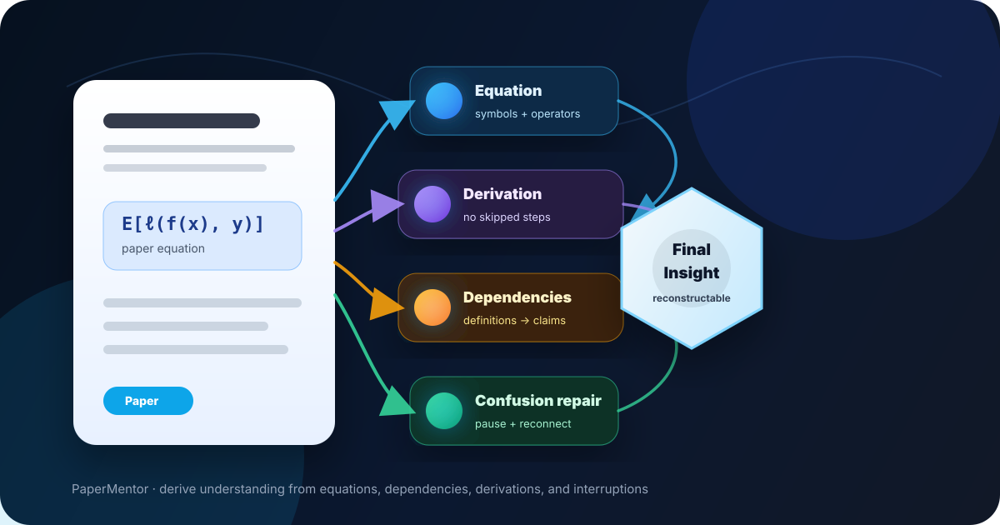
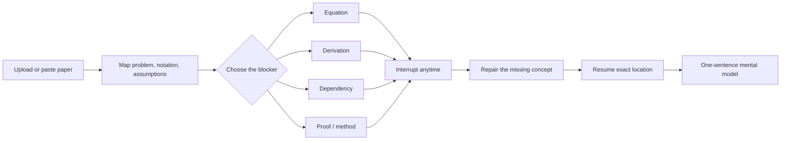

<div align="center">

# PaperMentor

### Understand uploaded papers in one focused 30-minute reading loop.

Built for the era of overflowing papers: upload or paste a paper, trace the math, repair confusion, and leave with a working mental model you can actually reconstruct.

Works with **Codex** and **Claude Code**.



[](#install)
[](skills/papermentor/SKILL.md)
[](https://code.claude.com/docs/en/skills)
[](#what-the-output-looks-like)
[](LICENSE)

**Do not summarize papers. Debug understanding.**

</div>

---

## The problem PaperMentor solves

Most paper tools compress the paper. PaperMentor does the opposite: it slows down at the exact point where understanding breaks.

A useful reading session should answer:

- What is the paper trying to prove or build?
- Which definitions and assumptions does this line depend on?
- What does every symbol in this equation mean?
- How did the derivation move from one line to the next?
- What should I remember as the final mental model?

---

## The 30-minute paper loop



Start broad, then narrow quickly. PaperMentor is designed for active reading, not passive summaries.

---

## Install

Codex:

```bash
curl -fsSL https://raw.githubusercontent.com/ShinyJay2/PaperMentor/main/install.sh | bash
```

Claude Code:

```bash
curl -fsSL https://raw.githubusercontent.com/ShinyJay2/PaperMentor/main/install.sh | bash -s claude
```

Both:

```bash
curl -fsSL https://raw.githubusercontent.com/ShinyJay2/PaperMentor/main/install.sh | bash -s all
```

Windows PowerShell:

```powershell
iwr -useb https://raw.githubusercontent.com/ShinyJay2/PaperMentor/main/install.ps1 | iex
```

```powershell
$env:PAPERMENTOR_TARGET='claude'; iwr -useb https://raw.githubusercontent.com/ShinyJay2/PaperMentor/main/install.ps1 | iex
```

Install locations:

```text
Codex:       ~/.codex/skills/papermentor
Claude Code: ~/.claude/skills/papermentor
```

---

## How to use it

| Goal | Prompt |
| --- | --- |
| Start a reading session | `Use $papermentor to scan this paper.` |
| Explain notation | `Use $papermentor to explain Equation (7) atomically.` |
| Fill skipped algebra | `Trace Eq. (3) → Eq. (5) without skipping derivation steps.` |
| Repair confusion | `Pause. Why did the sign flip here?` |
| Finish the paper | `Extract the final mental model and dependency chain.` |

Command intents are documented in [`skills/papermentor/commands.md`](skills/papermentor/commands.md).

---

## Reading modes

<table>
<tr>
<td width="33%" valign="top">

### Paper map
Problem, notation, assumptions, claims, equations, proof structure, and likely confusion points.

</td>
<td width="33%" valign="top">

### Equation card
Rendered equation first, then symbols, operators, domains, constants, and assumptions.

</td>
<td width="33%" valign="top">

### Derivation trace
Every transition names the operation, substitution, cancellation, property, and validity reason.

</td>
</tr>
<tr>
<td width="33%" valign="top">

### Dependency trace
Backward dependencies, forward dependencies, missing dependency checks, and explanation order.

</td>
<td width="33%" valign="top">

### Confusion repair
Pause, answer, identify the missing dependency, give a minimal example, reconnect, resume.

</td>
<td width="33%" valign="top">

### Mental model
A compact reconstruction of the problem, intuition, equations, assumptions, and what breaks.

</td>
</tr>
</table>

---

## What the output looks like

### Rendered equation explanation

PaperMentor shows the equation before explaining it:

$$
\mathcal{R}(f)=\mathbb{E}_{(x,y)\sim\mathcal{D}}\left[\ell(f(x),y)\right]
$$

- $\mathcal{R}(f)$ — risk functional evaluated at predictor $f$.
- $(x,y)\sim\mathcal{D}$ — an input-label pair sampled from distribution $\mathcal{D}$.
- $\mathbb{E}_{(x,y)\sim\mathcal{D}}$ — expectation over that sampling process.
- $\ell(f(x),y)$ — loss comparing prediction $f(x)$ with target $y$.

### Trace a derivation

Start:

$$
\|a-b\|_2^2=(a-b)^\top(a-b)
$$

Next:

$$
\|a-b\|_2^2=a^\top a-2a^\top b+b^\top b
$$

Transition:

- **Operation:** expand the quadratic product.
- **Property:** bilinearity and $a^\top b=b^\top a$ for real vectors.
- **Assumption:** $a,b\in\mathbb{R}^d$.
- **Why valid:** real inner products are scalar and symmetric.

### Map a dependency chain

- **Backward dependencies:** Definition 1 → Assumption A2 → Lemma 1 → Theorem 3
- **Forward dependencies:** Theorem 3 → Equation (12) → experiment interpretation
- **Missing dependency check:** convexity of $\ell$ is used but not stated
- **Recommended explanation order:** Definition 1, Assumption A2, Lemma 1, Theorem 3

### Plan a visualization

Every visualization plan includes a **question**, **concept**, **visual encoding**, **what to observe**, **conclusion**, and **limitation**.

| Field | Example |
| --- | --- |
| Question | Why do random projections approximately preserve distances? |
| Concept | Johnson-Lindenstrauss intuition |
| Visual encoding | Points, projection line, before/after distance bars |
| What to observe | Most relative distances remain similar with controlled distortion |
| Conclusion | Random projection trades exact geometry for compact representation |
| Limitation | The sketch is intuition, not the concentration proof |

---

## Project anatomy

```text
prompts/              specialized tutor modes
skills/papermentor/   installable Skill entrypoint
commands.md           command-like interaction contract
templates/            output structures
examples/             concrete behavior examples
tests/                human review checklists
```

Validation:

```bash
npm test
```

The validator checks required files, skill frontmatter, command coverage, visualization policy consistency, and install-smoke coverage for both Codex and Claude Code.

---

## Product boundaries

PaperMentor focuses on understanding work: equations, derivations, dependencies, interruptions, recursive why, visual support, and mental model extraction.

Deliberately out of scope: blog export, reviewer simulation, and quiz generation.

Planned extensions: local PDF section locator helpers, citation graph helpers, notebook visualization snippets, and persistent reading sessions.

---

<div align="center">

Stop skimming papers blind. Start debugging understanding.

MIT License © PaperMentor contributors

</div>
