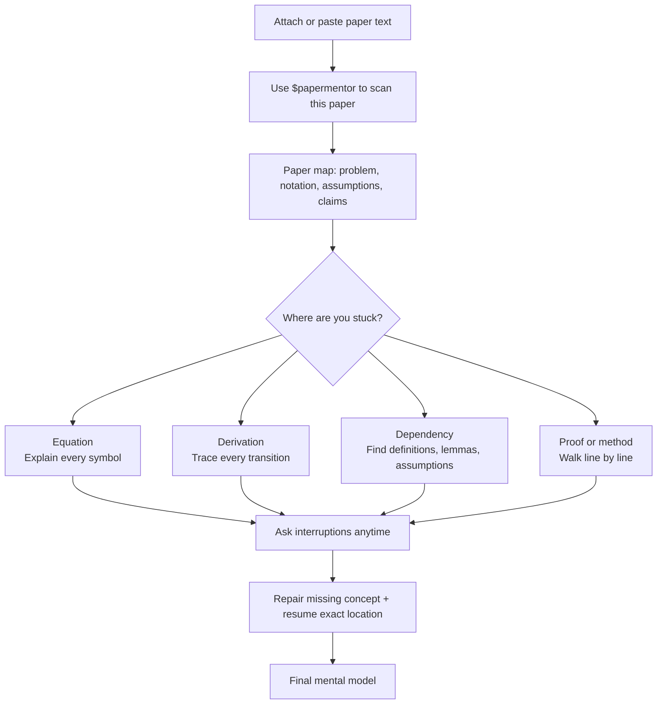

<div align="center">

# PaperMentor

### Understand uploaded papers in one focused 30-minute reading loop.

Built for the era of overflowing papers: upload or paste a paper, trace the math, repair confusion, and leave with a working mental model you can actually reconstruct.

Works with **Codex** and **Claude Code**.


[](#-quick-start)
[](LICENSE)
[](skills/papermentor/SKILL.md)
[](https://code.claude.com/docs/en/skills)
[](#-latex-first)

**Do not summarize papers. Debug understanding.**

[Install](#-quick-start) · [Use](#-use-it) · [Features](#-features) · [Examples](#-examples) · [Scope](#-scope--roadmap)

</div>

---

Papers are arriving faster than anyone can read them. PaperMentor is for the moment when you need to understand one now — not skim the abstract, not collect a summary, but build a usable mental model quickly.

Upload or paste the paper, run the guided loop, and spend the next 30 minutes resolving the exact equations, dependencies, and assumptions that block understanding.

---

## ✨ Features

<table>
<tr>
<td width="50%" valign="top">

### 🧮 Atomic equations
Show the equation first, then explain every symbol, operator, subscript, superscript, domain, codomain, expectation, norm, index set, and constant.

</td>
<td width="50%" valign="top">

### 🧵 Derivation tracing
Never jump between equations. Explain what changed, which operation was applied, what was substituted, what cancelled, and why it is valid.

</td>
</tr>
<tr>
<td width="50%" valign="top">

### 🔗 Dependency maps
Trace definitions, lemmas, theorems, algorithms, equations, assumptions, and claims backward and forward.

</td>
<td width="50%" valign="top">

### ⏸️ Interruptible reading
Pause mid-paper, answer the confusion, identify the missing dependency, give a minimal example, reconnect, and resume.

</td>
</tr>
<tr>
<td width="50%" valign="top">

### 🧠 Mental model extraction
End with the one-sentence model, the dependency chain behind it, and what breaks if assumptions fail.

</td>
<td width="50%" valign="top">

### 🖼️ Concept visuals
Use visualization only when it helps: geometry, distributions, random projections, optimization landscapes, algorithms, or trends.

</td>
</tr>
</table>

---

## 🚀 Quick Start

Codex:

```bash
curl -fsSL https://raw.githubusercontent.com/ShinyJay2/PaperMentor/main/install.sh | bash
```

Claude Code:

```bash
curl -fsSL https://raw.githubusercontent.com/ShinyJay2/PaperMentor/main/install.sh | bash -s claude
```

Install both:

```bash
curl -fsSL https://raw.githubusercontent.com/ShinyJay2/PaperMentor/main/install.sh | bash -s all
```

Windows PowerShell:

```powershell
iwr -useb https://raw.githubusercontent.com/ShinyJay2/PaperMentor/main/install.ps1 | iex
```

```powershell
$env:PAPERMENTOR_TARGET='claude'; iwr -useb https://raw.githubusercontent.com/ShinyJay2/PaperMentor/main/install.ps1 | iex
```

Install paths:

```text
Codex:       ~/.codex/skills/papermentor
Claude Code: ~/.claude/skills/papermentor
```

---

## ⚡ Use it

Start with one simple request, then follow the paper wherever your understanding breaks.



### Common starting prompts

| Goal | Say this |
| --- | --- |
| Start reading | `Use $papermentor to scan this paper.` |
| Understand notation | `Use $papermentor to explain Equation (7) atomically.` |
| Fill skipped math | `Trace Eq. (3) → Eq. (5) without skipping derivation steps.` |
| Interrupt reading | `Pause. Why did the sign flip here?` |
| Finish the paper | `Extract the final mental model and dependency chain.` |

---

## 🧭 Commands

| Intent | What it does |
| --- | --- |
| `/papermentor scan` | Paper map |
| `/papermentor prerequisites` | Missing background ladder |
| `/papermentor equation` | Atomic equation card |
| `/papermentor derive` | Derivation trace |
| `/papermentor dependencies` | Backward/forward dependency trace |
| `/papermentor proof` | Proof walkthrough |
| `/papermentor method` | Method dissection |
| `/papermentor confusion` | Interruption repair |
| `/papermentor why` | Recursive why |
| `/papermentor mental-model` | Final mental model |
| `/papermentor visualize` | Visualization plan |

Full contract: [`skills/papermentor/commands.md`](skills/papermentor/commands.md)

---

## 🧪 Examples

### LaTeX-first

All non-trivial math must be displayed in LaTeX before explanation. Never use ASCII math as a replacement.

```markdown
\[
\mathcal{R}(f)=\mathbb{E}_{(x,y)\sim\mathcal{D}}\left[\ell(f(x),y)\right]
\]

| Symbol | Meaning |
| --- | --- |
| \(\mathcal{R}(f)\) | Risk functional evaluated at predictor \(f\). |
| \(\mathbb{E}_{(x,y)\sim\mathcal{D}}\) | Expectation over data pairs from \(\mathcal{D}\). |
| \(\ell(f(x),y)\) | Loss comparing prediction \(f(x)\) with target \(y\). |
```

### Derivation trace example

```markdown
\[
\|a-b\|_2^2=(a-b)^\top(a-b)
\]

\[
\|a-b\|_2^2=a^\top a-2a^\top b+b^\top b
\]

- Operation: expand the quadratic product.
- Property: bilinearity and \(a^\top b=b^\top a\) for real vectors.
- Assumption: \(a,b\in\mathbb{R}^d\).
```

### Dependency trace example

```markdown
Backward dependencies: Definition 1 → Assumption A2 → Lemma 1.
Forward dependencies: Theorem 3 → Equation (12) → experiment interpretation.
Missing dependency check: convexity of \(\ell\) is used but not stated.
Recommended explanation order: Definition 1, Assumption A2, Lemma 1, Theorem 3.
```

### Visualization example

Every visualization plan includes: question, concept, visual encoding, what to observe, conclusion, and limitation.

```markdown
Question: Why do random projections approximately preserve distances?
Concept: Johnson-Lindenstrauss intuition.
Visual encoding: points, projection line, before/after distance bars.
What to observe: most relative distances remain similar with controlled distortion.
Conclusion: random projection trades exact geometry for compact representation.
Limitation: the sketch is intuition, not the concentration proof.
```

---

## 🧠 Under the Hood

PaperMentor is modular:

- [`prompts/`](prompts/) — scanner, prerequisite analyzer, equation analyzer, derivation tracer, dependency tracer, proof analyzer, method analyzer, confusion resolver, mental-model extractor, visualization planner.
- [`templates/`](templates/) — paper maps, equation cards, derivation traces, dependency traces, proof walkthroughs, recursive why, mental models, visualization cards.
- [`examples/`](examples/) — concrete examples for derivations, dependencies, sign/magnitude confusion, and mental models.
- [`tests/`](tests/) — checklists for LaTeX quality, no-handwave behavior, visualization quality, and trace completeness.

---

## ✅ Testing

```bash
npm test
```

The validator checks required files, skill frontmatter, command coverage, visualization policy consistency, and install-smoke coverage for bundled resources.

---

## 🤝 Contributing

Improve understanding, not product sprawl. Keep the core product focused on equations, derivations, dependencies, interruptions, recursive why, visual support, and mental model extraction.

See [`CONTRIBUTING.md`](CONTRIBUTING.md).

---

## 🗺️ Scope & Roadmap

**Current focus:** paper maps, prerequisite ladders, atomic equations, derivation traces, dependency traces, proof walkthroughs, method dissection, interruptions, recursive why, visualization support, and mental models.

**Deliberately out of scope:** blog export, reviewer simulation, and quiz generation.

**Planned extensions:** local PDF section locator helpers, citation graph helpers, notebook visualization snippets, and persistent reading sessions.

---

<div align="center">

Stop skimming papers blind. Start debugging understanding.

MIT License © PaperMentor contributors

</div>
